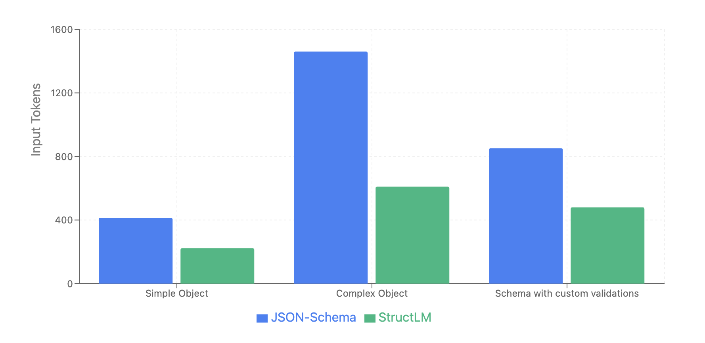

# StructLM

[](https://github.com/nadeesha/structlm/actions/workflows/ci.yml)
[](https://www.npmjs.com/package/structlm)
[](https://www.npmjs.com/package/structlm)
[](https://github.com/nadeesha/structlm/blob/main/LICENSE)
[](https://www.typescriptlang.org/)

**Token-efficient schema definition for getting structured output from LLMs.**

## Why StructLM?

- **Compact schema definition**: StructLM uses a proprietary object notation that is more compact and is more token-efficient than JSON schemas.

- **Clear and readable**: StructLM's schema definition is human-readable, and is more similar to natural TypeScript syntax.

- **More expressive validation**: Validations are defined as functions, and are serialized to be sent to LLMs.

- **No accuracy loss**: Despite being more compact, StructLM does not lose any accuracy when generating structured output, when compared to JSON schemas. See [BENCHMARKS.md](BENCHMARKS.md) for more details on our benchmarks.

- **Lightweight**: Zero dependencies, focused solely on runtime schema definition, and output validation.

- **Type-safety**: StructLM provides full zod-like TypeScript type inference at compile time, and assertions at run time.

# Benchmarks

This is a benchmark of StructLM vs JSON Schema, using Claude 3.5 Haiku. For the full benchmark, see [BENCHMARKS.md](BENCHMARKS.md).



### Simple Object
- JSON-Schema: 414 tokens (average)
- StructLM: 222 tokens (average)
- Reduction: 46.4% (average)
- Accuracy: Equal

### Complex Object
- JSON-Schema: 1460 tokens (average)
- StructLM: 610 tokens (average)
- Reduction: 58.2% (average)
- Accuracy: StructLM is slightly better (+0.4% on average)

### Schema with custom validations
- JSON-Schema: 852 tokens (average)
- StructLM: 480 tokens (average)
- Reduction: 43.7% (average)
- Accuracy: Equal

## Installation

```bash
npm install structlm
```

## Quick Start

```typescript
import { s } from 'structlm';

// Define a user schema
const userSchema = s.object({
  name: s.object({
    first: s.string(),
    last: s.string()
  }),
  age: s.number(),
  active: s.boolean(),
  tags: s.array(s.string())
});

// Generate schema description for LLM
console.log(userSchema.stringify());
// Output: "{ name: { first: string, last: string }, age: number, active: boolean, tags: [string] }"

// Parse and validate JSON data
const userData = userSchema.parse('{"name":{"first":"John","last":"Doe"},"age":30,"active":true,"tags":["developer","typescript"]}');
// Returns: { name: { first: "John", last: "Doe" }, age: 30, active: true, tags: ["developer", "typescript"] }
```

## Simple LLM Integration

Here's a complete example showing how to use StructLM with an LLM to extract structured data:

```typescript
import { s } from 'structlm';

// 1. Define your schema
const contactSchema = s.object({
  name: s.string(),
  email: s.string().validate(email => email.includes('@')),
  phone: s.string().optional(),
  company: s.string()
});

// 2. Create your prompt with the schema
const text = "Contact John Doe at john@example.com or call (555) 123-4567. He works at Tech Corp.";

const prompt = `
Extract contact information from the following text and return it as JSON matching this structure:
${contactSchema.stringify()}

Text: "${text}"

Return only the JSON object, no additional text.`;

// The schema.stringify() outputs: 
// { name: string, email: string /* email=>email.includes('@') */, phone: string /* optional */, company: string }

// 3. Send prompt to LLM (the LLM returns this JSON string)
const llmResponse = `{
  "name": "John Doe",
  "email": "john@example.com", 
  "phone": "(555) 123-4567",
  "company": "Tech Corp"
}`;

// 4. Parse and validate the LLM response
const contact = contactSchema.parse(llmResponse);
// Returns: { name: "John Doe", email: "john@example.com", phone: "(555) 123-4567", company: "Tech Corp" }

// The parse() method validates the email format and ensures all required fields are present
```

## API Reference

For the specification of the custom object notation, see [SPECIFICATION.md](SPECIFICATION.md).

### Basic Types

#### `s.string()`
Creates a string schema.

```typescript
const nameSchema = s.string();
console.log(nameSchema.stringify()); // "string"

// Parse and validate a string
const name = nameSchema.parse('"John"'); // "John"
```

#### `s.number()`
Creates a number schema.

```typescript
const ageSchema = s.number();
console.log(ageSchema.stringify()); // "number"

// Parse and validate a number
const age = ageSchema.parse('25'); // 25
```

#### `s.boolean()`
Creates a boolean schema.

```typescript
const activeSchema = s.boolean();
console.log(activeSchema.stringify()); // "boolean"

// Parse and validate a boolean
const isActive = activeSchema.parse('true'); // true
```

### Complex Types

#### `s.array(itemSchema)`
Creates an array schema with specified item type.

```typescript
const numbersSchema = s.array(s.number());
console.log(numbersSchema.stringify()); // "[number]"

// Parse and validate an array
const numbers = numbersSchema.parse('[1, 2, 3, 4]'); // [1, 2, 3, 4]

const usersSchema = s.array(s.object({
  name: s.string(),
  age: s.number()
}));
console.log(usersSchema.stringify()); 
// "[ { name: string, age: number } ]"

// Parse complex array
const users = usersSchema.parse('[{"name":"John","age":30},{"name":"Jane","age":25}]');
// Returns: [{ name: "John", age: 30 }, { name: "Jane", age: 25 }]
```

#### `s.object(shape)`
Creates an object schema with specified properties.

```typescript
const personSchema = s.object({
  name: s.string(),
  age: s.number(),
  address: s.object({
    street: s.string(),
    city: s.string(),
    zipCode: s.string()
  })
});

console.log(personSchema.stringify());
// "{ name: string, age: number, address: { street: string, city: string, zipCode: string } }"

// Parse and validate an object
const person = personSchema.parse(`{
  "name": "John Doe",
  "age": 30,
  "address": {
    "street": "123 Main St",
    "city": "Anytown",
    "zipCode": "12345"
  }
}`);
// Returns typed object with validation
```

### Validation

#### `.validate(fn)`
Adds custom validation using a JavaScript function. 

** IMPORTANT **: Validation functions need to be pure functions, and not reference any external variables. 

```typescript
const emailSchema = s.string().validate(email => email.includes('@'));
const positiveNumberSchema = s.number().validate(n => n > 0);
const adultAgeSchema = s.number().validate(age => age >= 18);

// Chaining validation with schema definition
const userSchema = s.object({
  email: s.string().validate(email => email.includes('@')),
  age: s.number().validate(age => age >= 0),
  username: s.string().validate(name => name.length >= 3)
});
```

#### `.optional()`
Makes a field optional in object schemas.

```typescript
const userSchema = s.object({
  name: s.string(),
  age: s.number().optional(),
  bio: s.string().validate(bio => bio.length <= 500).optional(),
  tags: s.array(s.string()).optional()
});

console.log(userSchema.stringify());
// Output: "{ name: string, age: number /* optional */, bio: string /* bio=>bio.length<=500, optional */, tags: [string] /* optional */ }"

// All these are valid:
userSchema.parse('{"name":"John"}');
userSchema.parse('{"name":"John","age":30}');
userSchema.parse('{"name":"John","age":30,"bio":"Developer","tags":["js","ts"]}');
```

## Type Inference

StructLM provides full TypeScript type inference:

```typescript
import { s, Infer } from 'structlm';

const userSchema = s.object({
  name: s.string(),
  age: s.number(),
  active: s.boolean()
});

type User = Infer<typeof userSchema>;
// User = { name: string; age: number; active: boolean; }
```

## Advanced Examples

### Nested Complex Schema

```typescript
const apiResponseSchema = s.object({
  status: s.string().validate(s => ['success', 'error'].includes(s)),
  data: s.object({
    users: s.array(s.object({
      id: s.number(),
      profile: s.object({
        name: s.object({
          first: s.string(),
          last: s.string()
        }),
        contact: s.object({
          email: s.string().validate(email => email.includes('@')),
          phone: s.string()
        })
      }),
      permissions: s.array(s.string()),
      metadata: s.object({
        createdAt: s.string(),
        lastLogin: s.string(),
        loginCount: s.number().validate(n => n >= 0)
      })
    }))
  }),
  pagination: s.object({
    page: s.number().validate(n => n > 0),
    limit: s.number().validate(n => n > 0),
    total: s.number().validate(n => n >= 0)
  })
});

console.log(apiResponseSchema.stringify());
// Outputs clean, readable schema description
```

### Validation Examples

```typescript
// Email validation
const emailSchema = s.string().validate(email => {
  const emailRegex = /^[^\s@]+@[^\s@]+\.[^\s@]+$/;
  return emailRegex.test(email);
});

// Age validation
const ageSchema = s.number().validate(age => age >= 0 && age <= 120);

// Username validation
const usernameSchema = s.string().validate(username => {
  return username.length >= 3 && 
         username.length <= 20 && 
         /^[a-zA-Z0-9_]+$/.test(username);
});

// Complex object with multiple validations
const registrationSchema = s.object({
  username: usernameSchema,
  email: emailSchema,
  age: ageSchema,
  password: s.string().validate(pwd => pwd.length >= 8),
  confirmPassword: s.string(),
  acceptTerms: s.boolean().validate(accepted => accepted === true)
});
```

## StructLM vs JSON Schema

StructLM provides a more compact alternative to JSON Schema for LLM applications. Here's how they compare:

**JSON Schema:**
```json
{
  "type": "object",
  "properties": {
    "name": {
      "type": "string",
      "minLength": 2
    },
    "email": {
      "type": "string",
      "format": "email"
    },
    "age": {
      "type": "number",
      "minimum": 18,
      "maximum": 120
    },
    "roles": {
      "type": "array",
      "items": { "type": "string" },
      "minItems": 1
    }
  },
  "required": ["name", "email", "age", "roles"]
}
```

**StructLM Schema:**
```text
{ 
  name: string /* name=>name.length>=2 */, 
  email: string /* email=>email.includes("@") */, 
  age: number /* age=>age>=18&&age<=120 */, 
  roles: [string] /* arr=>arr.length>=1 */ 
}
```

To get this schema, this is the expression you would use:

```typescript
const userSchema = s.object({
  name: s.string().validate(name => name.length >= 2),
  email: s.string().validate(email => email.includes('@')),
  age: s.number().validate(age => age >= 18 && age <= 120),
  roles: s.array(s.string()).validate(arr => arr.length >= 1)
});
```

## Frequently Asked Questions

### **General Usage**

#### **Q: How is StructLM different from Zod?**
A: While StructLM is inspired by Zod's API, it's specifically designed for LLM integration. StructLM generates compact schema descriptions optimized for AI prompts (XX% fewer tokens), while Zod focuses on general TypeScript validation. StructLM's `.stringify()` method produces LLM-friendly output, whereas Zod employs `zod-to-json-schema` or equivalent tools.

#### **Q: Can I use StructLM for regular data validation without LLMs?**
A: Yes! StructLM mostly works for standard TypeScript data validation. Use `.parse()` for validation and type inference just like Zod. However, StructLM's main advantage is its token-efficient LLM integration capabilities. Therefore, some of the more advanced Typescript features like discriminated unions, recursive types, etc. may not work as expected right now.

#### **Q: Which LLMs work with StructLM?**
StructLM itself is model agnostic, and works as a schema definition and data validation library. Reliability may vary by model, but our benchmarks show consistent results across major providers.

#### **Q: Does StructLM work in the browser?**
A: Yes! StructLM is a lightweight TypeScript library with zero dependencies that works in browsers, Node.js, Deno, and Bun.

### **Schema Definition**

#### **Q: How do I make a field optional?**
A: Use the `.optional()` method on any field:
```typescript
const schema = s.object({
  name: s.string(),
  age: s.number().optional(),
  email: s.string().validate(e => e.includes('@')).optional()
});

// Outputs: { name: string, age: number /* optional */, email: string /* e=>e.includes("@"), optional */ }
```

Optional fields are excluded from validation when missing from the input data.

#### **Q: Can I use unions/discriminated unions like in Zod?**
A: Union types are not currently supported but are on the roadmap. For now, use string validation with enums:
```typescript
const statusSchema = s.string().validate(status => 
  ['pending', 'approved', 'rejected'].includes(status)
);
```

#### **Q: How do I validate nested arrays?**
A: Use nested `s.array()` calls:
```typescript
const matrixSchema = s.array(s.array(s.number()));
// Outputs: [[number]]

const complexSchema = s.array(
  s.object({
    items: s.array(s.string()).validate(arr => arr.length > 0)
  })
);
```

#### **Q: Can validation functions access other fields in the object?**
A: No, validation functions only receive the current field's value. Cross-field validation isn't currently supported.

### **LLM Integration**

#### **Q: Do LLMs really understand StructLM's compact format better?**
A: Our benchmarks show equal or better accuracy compared to JSON Schema. The compact format is:
- Less verbose and confusing
- More similar to natural TypeScript syntax
- Includes validation hints inline
- Reduces prompt complexity

#### **Q: Can I combine multiple schemas in one prompt?**
A: Yes! Use `.stringify()` on multiple schemas:
```typescript
const userSchema = s.object({...});
const orderSchema = s.object({...});

const prompt = `
Process this data and return:
- User: ${userSchema.stringify()}
- Order: ${orderSchema.stringify()}
`;
```

#### **Q: How do I handle LLM responses that don't match the schema?**
A: StructLM's `.parse()` method throws descriptive errors for invalid data:
```typescript
try {
  const result = schema.parse(llmResponse);
} catch (error) {
  console.log('LLM returned invalid data:', error.message);
  // Handle error: retry, use fallback, etc.
}
```

### **Performance**

#### **Q: What's the performance overhead?**
A: StructLM is lightweight:
- Schema creation: Minimal overhead
- `.stringify()`: Fast string concatenation
- `.parse()`: JSON.parse + validation functions
- No runtime dependencies

#### **Q: Can I pre-compile schemas for better performance?**
A: Schema stringification is already very fast, but you can cache results:
```typescript
const userSchemaString = userSchema.stringify();
// Reuse userSchemaString in multiple prompts
```

### **Troubleshooting**

#### **Q: Why is my validation function not working in LLM prompts?**
A: Validation functions are serialized as text hints for LLMs but only enforced during `.parse()`. Make sure your function:
- Uses simple, clear logic
- Doesn't reference external variables
- Is readable when converted to string

#### **Q: Can I see what the validation hints look like?**
A: Yes! Use `.stringify()` to see exactly what gets sent to the LLM:
```typescript
console.log(schema.stringify());
// Shows the compact format with validation hints
```

## Contributing

We welcome contributions! Please open an issue or submit a pull request on GitHub.

## License

Apache 2.0 License

## Support

- 🐛 [Report Issues](https://github.com/nadeesha/structlm/issues)
- 💡 [Feature Requests](https://github.com/nadeesha/structlm/discussions)
- 📖 [Documentation](https://github.com/nadeesha/structlm)
